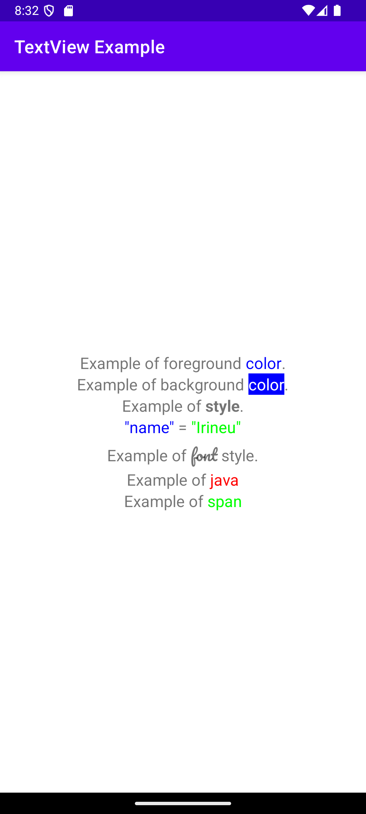
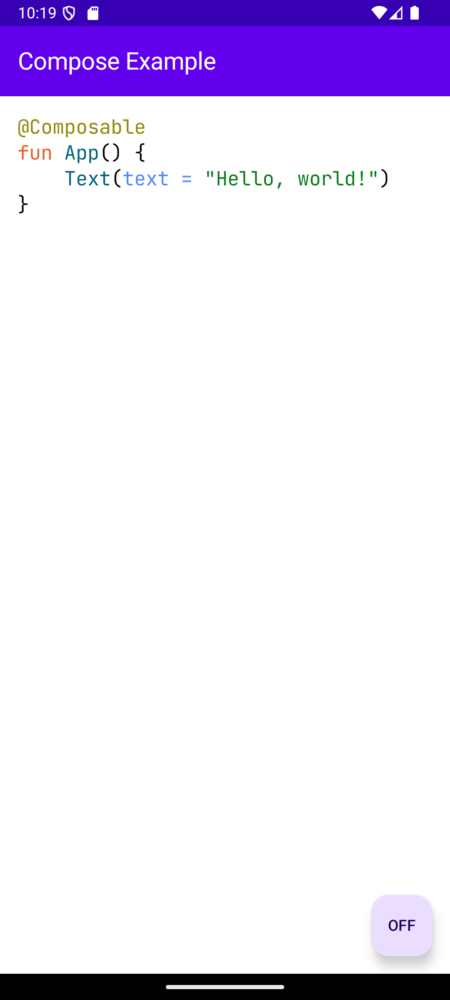

# Highlight 

Highlight text snippets in **Jetpack Compose** or **View-based** using regular expressions.

## Objective

Facilitate the creation of dynamic highlights using regular expressions, useful for creating code editors or text editors with custom formatting.

## Quick Start

The central class is `Highlight`, from which highlighted texts are generated in formats like `SpannedString` for View-based or `AnnotatedString` for Jetpack Compose, from schemes defined by `Scheme<*>`.

**Usage Example**

``` kotlin
val highlight = Highlight(
    TextColorScheme(
        regex = "\\b(color)\\b".toRegex(),
        match = Match.fully(UiColor.Black)
    )
)

// Jetpack Compose
val text = highlight.toAnnotatedString("Example of foreground color.")

// View-based
val text = highlight.toSpannedString("Example of foreground color.")
```

You can also use extensions to simplify the creation of highlights:

``` kotlin
val highlight = Highlight {
    textColor {
        fully(
            regex = "\\b(color)\\b",
            UiColor.Black
        )
    }
}

// Jetpack Compose
val text = highlight.toAnnotatedString("Example of foreground color.")

// View-based
val text = highlight.toSpannedString("Example of foreground color.")
```

## Jetpack Compose

In Jetpack Compose, work with `AnnotatedString` or `TextFieldValue` to integrate the highlight into your layout.

**Usage Example**

``` kotlin
val highlight = rememberHighlight {
    spanStyle {
         fully(
            regex = "\\b(styled)\\b",
            SpanStyle(
                color = Color.White,
                background = Color.Black,
                fontStyle = FontStyle.Italic,
            )
        )
    }
}

// AnnotatedString
Text(
    text = highlight.rememberAnnotatedString(
        "Example of styled text."
    )
)

// TextFieldValue
val textFieldValue = rememberSaveable { mutableStateOf(TextFieldValue()) }

BasicTextField(
    value = highlight.rememberTextFieldValue(
        textFieldValue.value
    ).copy(
        composition = null
    ),
    onValueChange = {
        textFieldValue.value = it
    }
)
```

## View-based

In View-based environments, work with `SpannedString`, `Editable`, or `SpannableString` to apply the highlights.

**Usage Example**

``` kotlin
val highlight = Highlight {
    backgroundColor {
        fully(
            regex = "\\b(color)\\b",
            UiColor.Blue
        )
    }
    textColor {
        fully(
            regex = "\\b(color)\\b",
            UiColor.White
        )
    }
}

// TextView
binding.tvExample.text = highlight.toSpannedString(
    "Example of background color."
)

// EditText (Editable or Spannable)
highlight.apply(binding.etExample)
```

## Groups

Instead of applying the highlight to the entire match using `Match.fully(..)`, you can separate it by groups, allowing for more complex highlights.

**Usage Example**

``` kotlin
val highlight = rememberHighlight {
    textColor {
        groups(
            regex = "(\\w+)\\s*=\\s*(\\w+)",
            UiColor.Blue,
            UiColor.Green
        )
    }
}

Text(
    text = highlight.rememberAnnotatedString("name = Highlight")
)
```

## Screenshots

| Simple example                                    | Code highlight                                    |
|---------------------------------------------------|---------------------------------------------------|
|  |  |


## Integration

To integrate the Highlight library into your project, you can add it directly from the [Maven Central repository](https://central.sonatype.com/namespace/com.neoutils.highlight).

### Gradle (Kotlin DSL)

Add the dependencies to your `build.gradle.kts` file:

``` kotlin
dependencies {
    // For View-based highlighting
    implementation("com.neoutils.highlight:highlight-view:2.0.0")
    // For Jetpack Compose highlighting
    implementation("com.neoutils.highlight:highlight-compose:2.0.0")
}
```